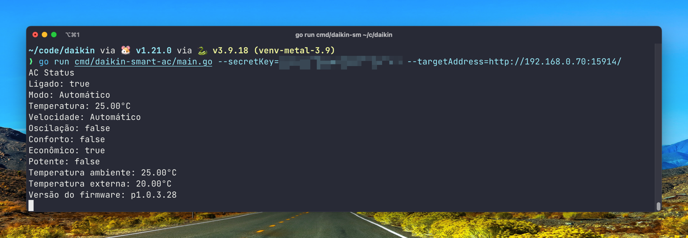

### API Daikin Split EcoSwing Smart R-32 e Split EcoSwing Smart Gold R-32

Controle e veja o status do ar-condicionado
[Daikin Split EcoSwing Smart R-32](https://www.daikin.com.br/produto/ecoswing-r32) e
[Daikin Split EcoSwing Smart Gold R-32](https://www.daikin.com.br/produto/split-ecoswing-smart-gold-r-32).

Para poder comunicar com o ar-condicionado é preciso de uma `secret key` e saber o endereço de IP do ar-condicionado.

Essa `secret key` é gerada pelo aplicativo
[Daikin Smart AC - Brasil](https://play.google.com/store/apps/details?id=in.co.iotalabs.dmb.smartac&hl=pt_BR&gl=US)
durante a configuração do ar-condicionado, ela também é salva no servidor que o aplicativo utiliza, dessa forma é
possível instalar o aplicativo em diferentes dispositivos e controlar o mesmo aparelho.

### Status

- [x] Suporte a extrair o `secret key` utilizando login e senha.
- [ ] Suporte a configurar o ar-condicionado sem necessidade de aplicativo.
- [x] Consultar status do ar-condicionado (servidor http).
- [ ] Enviar comandos para o ar-condicionado (servidor http).
- [ ] Receber atualizações do ar-condicionado (mqtt).
- [ ] Enviar comandos para o ar-condicionado (mqtt).

### Compatibilidade

Deve ser compatível com todos os aparelhos que utilizam o aplicativo **Daikin Smart AC - Brasil**.

#### Daikin Split EcoSwing Smart R-32:

| Unidade interna | Status         |
|-----------------|----------------|
| FTKP09Q5VL      | Deve funcionar |
| FTKP12Q5VL      | Deve funcionar |
| FTKP18Q5VL      | Deve funcionar |
| FTKP24Q5VL      | Deve funcionar |
| FTHP09Q5VL      | Deve funcionar |
| FTHP12Q5VL      | Deve funcionar |
| FTHP18Q5VL      | Deve funcionar |
| FTHP24Q5VL      | Deve funcionar |

#### Daikin Split EcoSwing Smart Gold R-32:

| Unidade interna | Status         |
|-----------------|----------------|
| FTKP09S5VL      | Deve funcionar |
| FTKP12S5VL      | Funcionando    |
| FTKP18S5VL      | Deve funcionar |
| FTKP24S5VL      | Deve funcionar |
| FTHP09S5VL      | Deve funcionar |
| FTHP12S5VL      | Funcionando    |
| FTHP18S5VL      | Deve funcionar |
| FTHP24S5VL      | Deve funcionar |

### Conseguindo uma `secret key`

O primeiro passo é configurar o ar utilizando o aplicativo oficial, durante o processo de configuração é criado
a `secret key`.

Depois disso, você pode conseguir a `secret key` de duas formas, inspecionando as requests que o
aplicativo oficial faz, especificamente para o endpoint `https://dmb.iotalabs.co.in/devices/thinginfo/managething`.

Você também pode utilizar o seguinte
site [https://daikin-extract-secret-key.fly.dev/](https://daikin-extract-secret-key.fly.dev/).
O código do serviço está presente em `cmd/extract-secret-key` e nenhuma informação de login/senha/dispositivo é
coletada.

Você também pode executar o serviço localmente.

### Engenharia reversa

Todo o processo de descoberta e implementação foi baseado na engenharia reversa do aplicativo para Android e da leitura
da biblioteca nativa que o aplicativo utiliza.

#### Aplicativo para Android

O aplicativo é **extremamente** lento considerando que faz algo tão simples, o motivo disso é que ele não guarda nenhum
dado local, toda vez que o aplicativo é aberto ou restaurado (`onResume`) ele faz requests para
o [Amazon Cognito](https://aws.amazon.com/pt/cognito/) para validar o cadastro do usuário e além de fazer requests para
verificar a versão do aplicativo.

Os servidores AWS utilizados ficam nos Estados Unidos, tornando as requests ainda mais lentas.

Depois das requests de autenticação de usuário é feito uma request para uma api hospedado também na AWS de gerenciamento
de IOT, enviando o token e recebendo os dados dos aparelhos cadastrados na conta. É feito tracking de versões do
Android, timezone, linguagem, localização (latitude, longitude), modelo dos aparelhos de ar-condicionado e também alguns
dados da rede wireless (como nome).

Também é feito algumas requests para o firebase relacionadas a logging.

O aplicativo parece ser feito por uma [empresa da India](http://iotalabs.co.in/) (o que não faz muito sentido para um
produto feito para o mercado brasileiro). É possível ver que o aplicativo não é uma solução whitelabel, já que em
diversas partes é hardcoded o domínio `daikin.com.br`.

O aplicativo tem uma usabilidade terrível, com controles lentos e capacidades básicas.

Ao controlar um ar-condicionado, o aplicativo tenta inicialmente falar na rede local e depois passa a utilizar `mqtt`
para enviar comandos para o ar-condicionado, permitindo receber atualizações e enviar comandos fora da rede do ar.

#### Ar-condicionado

O ar-condicionado possui um servidor http não conformante aos specs, tornando complicada comunicação (golang `http`
e `curl` não aceitam a resposta inválida), além disso, a forma de comunicação é no minima peculiar, as requests são
compostas por um conjunto de bytes base64 encodados, onde o conteúdo dos bytes é o seguinte:

- [**Initialization vector**](https://en.wikipedia.org/wiki/Initialization_vector): 16 bytes
- **Payload**: N bytes começando da posição 17
- **CRC16**: checksum de 2 bytes.

O conteúdo é criptografado utilizando [AES](https://en.wikipedia.org/wiki/Advanced_Encryption_Standard) no
modo [CFB](https://en.wikipedia.org/wiki/Block_cipher_mode_of_operation#Cipher_feedback_(CFB)), sendo o CRC ignorado no
processo de descriptografia.